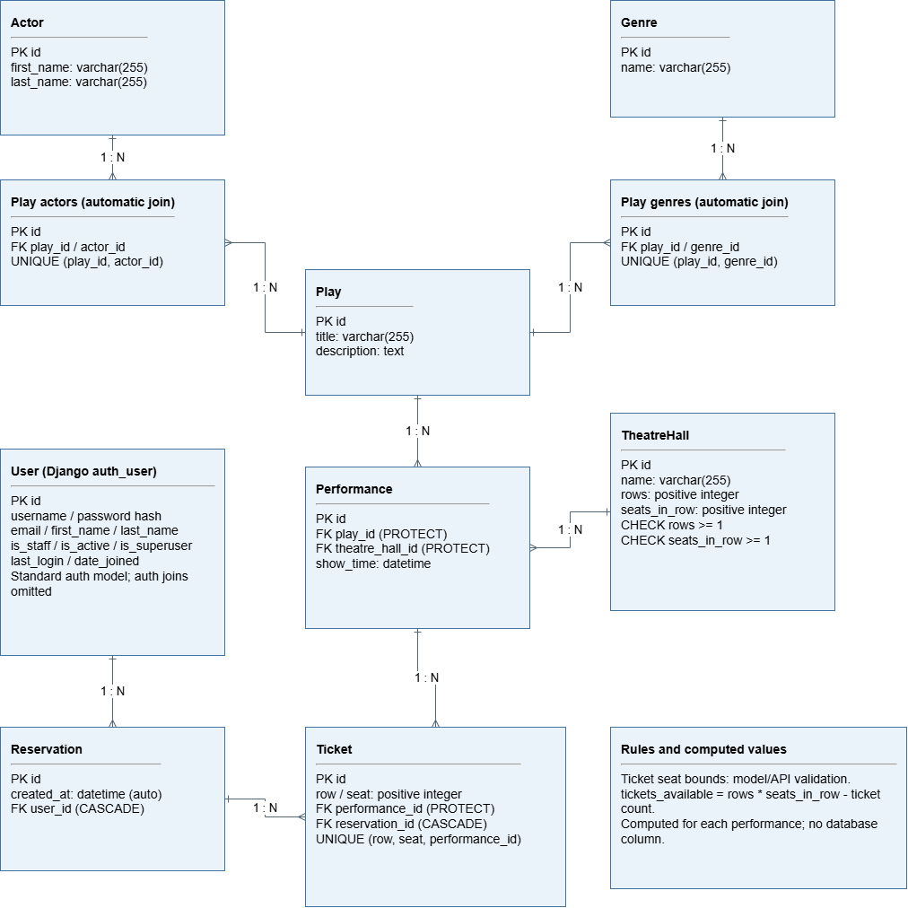
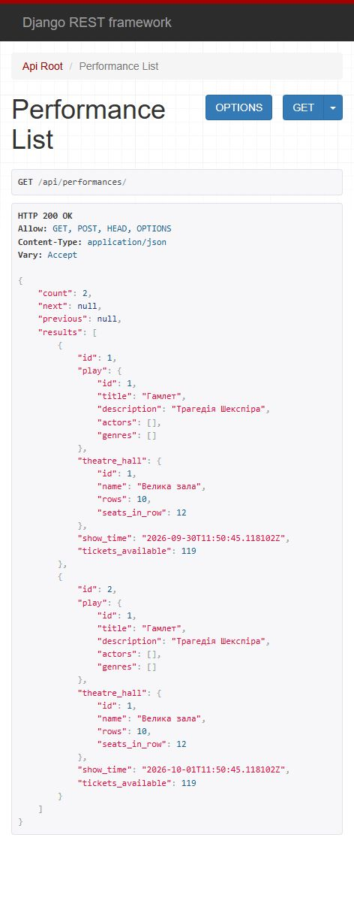
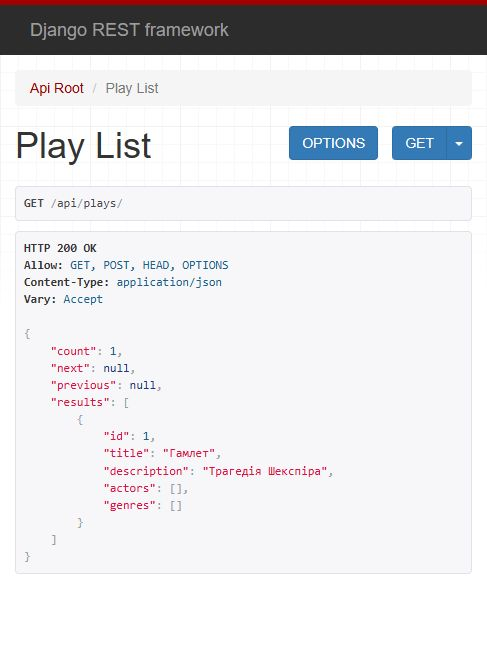
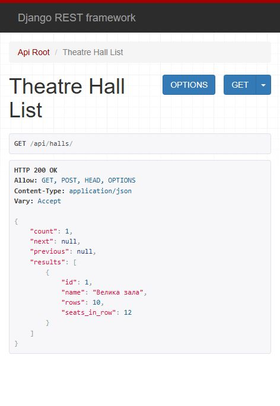

# Theatre API

An API for managing theatre plays, performances and ticket reservations,
built with Django REST Framework.

## Features

- Manage genres, actors, theatre halls, plays and performances.
- Filter plays by title, genres and actors.
- Filter performances by date and plays.
- See the available seat count for each performance.
- Browse paginated lists.
- Register users and authenticate using JWT.
- Create reservations with multiple tickets.
- View only your own reservations.
- Validate seat numbers and prevent duplicate bookings.
- Explore the API using Swagger UI.

## Requirements

- Python 3.12
- Git

## Local setup

Clone the repository and enter its directory:

```bash
git clone --branch develop https://github.com/2d1Corp/theater-api.git
cd theater-api
```

Create a virtual environment:

```bash
python -m venv .venv
```

Activate it on Windows PowerShell:

```powershell
.\.venv\Scripts\Activate.ps1
```

Or on Linux/macOS:

```bash
source .venv/bin/activate
```

Install dependencies:

```bash
python -m pip install -r requirements.txt
```

Copy the environment template on Windows PowerShell:

```powershell
Copy-Item .env.example .env
```

Or on Linux/macOS:

```bash
cp .env.example .env
```

Generate a unique local secret key:

```bash
python -c "import secrets; from dotenv import set_key; set_key('.env', 'SECRET_KEY', secrets.token_urlsafe(64))"
```

`.env` is ignored by Git. You can also provide `SECRET_KEY` through an environment
variable; it takes precedence over `.env`. The API requires a nonempty key.

Create the database tables:

```bash
python manage.py migrate
```

Create an administrator account to manage theatre data:

```bash
python manage.py createsuperuser
```

Start the development server:

```bash
python manage.py runserver
```

## API documentation

After starting the server:

- Swagger UI: http://127.0.0.1:8000/api/docs/
- OpenAPI schema: http://127.0.0.1:8000/api/schema/
- Admin panel: http://127.0.0.1:8000/admin/

The initial database is empty. On a fresh database, optionally load sample data:

```bash
python manage.py loaddata demo_data
```

The fixture contains two genres, two fictional actors, one hall, two plays and
two performances (June 1 and 2, 2027). Each performance initially has 120 available
seats. It contains no users, passwords, reservations or tickets. Create your own
account using the instructions below, then reserve a seat for performance `1`.

Use this fixture on a fresh database: its IDs can overwrite existing catalog
records. Alternatively, create your own theatre data through the admin panel.

## Tests

```bash
python manage.py test
```

## Authentication

### 1. Create an account

Open Swagger UI at http://127.0.0.1:8000/api/docs/.

Find `POST /api/user/create/`, click **Try it out** and submit:

```json
{
  "username": "theatre_user",
  "email": "user@example.com",
  "password": "example-password-123"
}
```

A successful request returns `201 Created`.

Skip registration if you already have an account, including an administrator
created with `createsuperuser`.

### 2. Obtain JWT tokens

Find `POST /api/user/token/` and submit your credentials:

```json
{
  "username": "theatre_user",
  "password": "example-password-123"
}
```

The response contains two tokens:

- `access`: used to authenticate API requests.
- `refresh`: used to obtain a new access token.

### 3. Authorize Swagger

Copy the value of `access` from the response.

Click **Authorize**, paste the token into the `jwtAuth` field and confirm.
Paste only the token, without quotes or the `Bearer` prefix.

Swagger adds this header to subsequent requests:

```http
Authorization: Bearer <access_token>
```

### 4. Check your account and reservations

Execute these requests:

- `GET /api/user/me/`: view your profile.
- `GET /api/reservations/`: view your reservations.

An empty reservation list is expected for a new account.

### 5. Refresh an expired access token

If a request returns `401` with `Token is expired`,
use `POST /api/user/token/refresh/`:

```json
{
  "refresh": "<your_refresh_token>"
}
```

Copy the new `access` token from the response.

In **Authorize**, click **Logout**, then authorize again using the new token.
If the refresh token has also expired, obtain new tokens using your
username and password.

## Permissions

- Anonymous users can read the theatre catalog.
- Staff users can create, update and delete catalog records.
- Authenticated users can create reservations and view only their own.
- An administrator created with `createsuperuser` has staff permissions.

## Create a reservation

Authorize Swagger using an access token.

### 1. Choose a performance

Execute `GET /api/performances/`.

Choose a performance from `results` and note:

- Its `id`.
- `theatre_hall.rows`: the number of rows.
- `theatre_hall.seats_in_row`: the number of seats in each row.
- `tickets_available`: the hall capacity minus tickets already reserved
  for this performance. This count is calculated when the list is requested.

If the list is empty, create theatre data using the admin panel.

### 2. Reserve tickets

Use `POST /api/reservations/`.

For example, this request reserves two seats for performance `1`:

```json
{
  "tickets": [
    {
      "row": 1,
      "seat": 1,
      "performance": 1
    },
    {
      "row": 1,
      "seat": 2,
      "performance": 1
    }
  ]
}
```

Replace the performance ID with an existing one.
Choose row and seat numbers within that performance's hall dimensions.

A successful request returns `201 Created`.
The reservation belongs to the authenticated user automatically.

The API rejects:

- Row or seat numbers outside the hall dimensions.
- The same seat repeated for the same performance in one request.
- Seats already reserved for that performance.

Invalid requests return `400 Bad Request`.
If any ticket fails, the entire reservation is rolled back.

### 3. View your reservations

Execute `GET /api/reservations/`.

The response contains only reservations belonging to the authenticated user.

## Filtering examples

Play filters:

```text
/api/plays/?title=ham
/api/plays/?genres=1,2
/api/plays/?actors=1,2
```

Performance filters:

```text
/api/performances/?date=2026-10-01
/api/performances/?plays=1,2
```

Replace the example IDs and date with values relevant to your data.

Filters can be combined:

```text
/api/plays/?title=ham&genres=1,2
```

Lists are paginated with 10 records per page:

```text
/api/plays/?page=2
```

With the default SQLite database, title filtering ignores case for ASCII
letters, but matching Cyrillic letters is case-sensitive.

## Database structure



The editable [draw.io source](docs/theatre-schema.drawio) includes the theatre
models, automatic many-to-many joins and booking constraints. Standard Django
authentication tables other than User are omitted for clarity.

## Browsable API screenshots

These screenshots show sample local data. A fresh installation starts empty.

### Performances and available seats



### Plays



### Theatre halls


